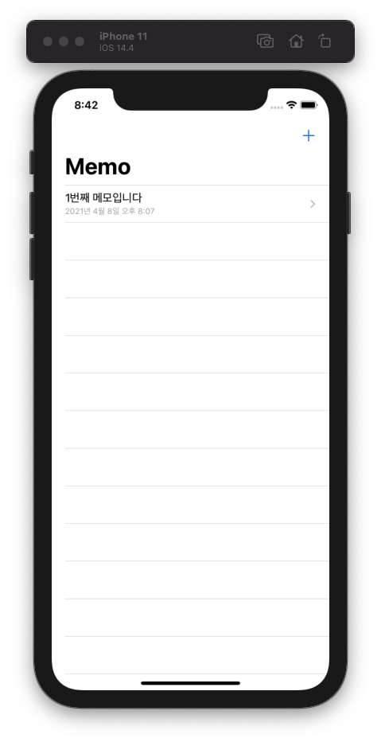
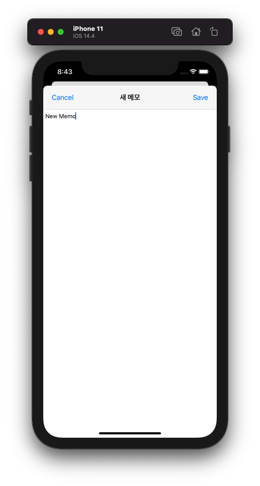
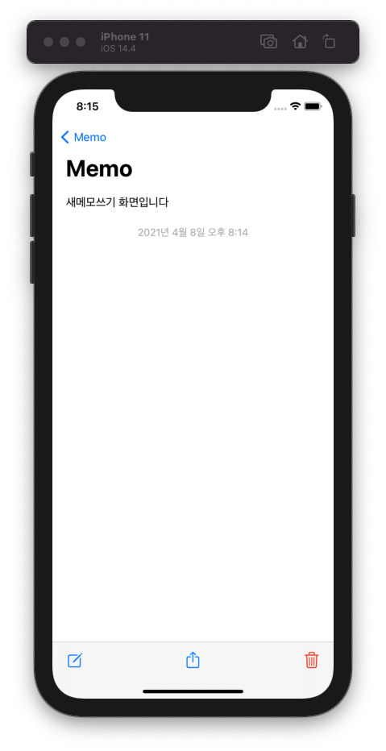
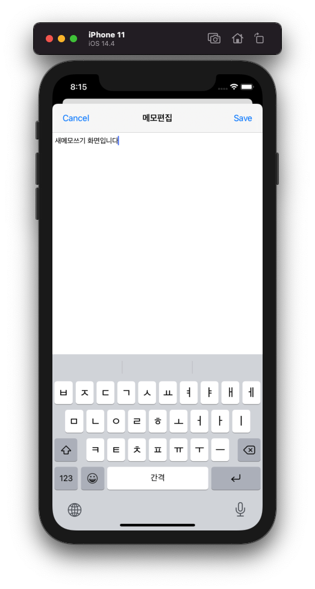
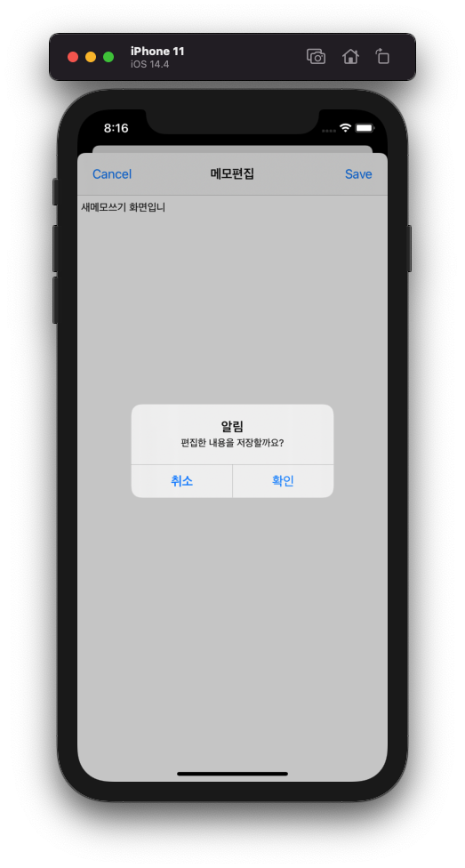
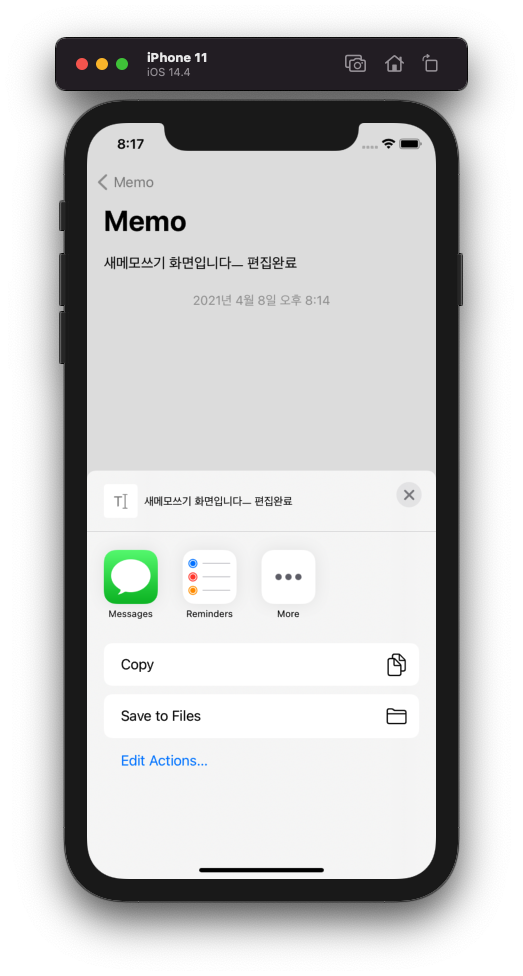
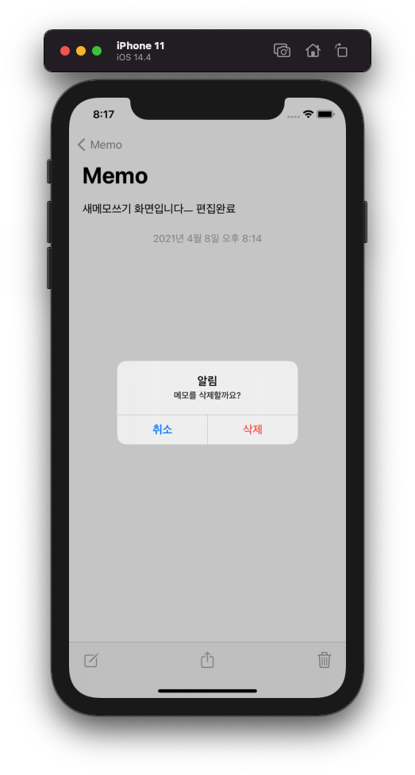
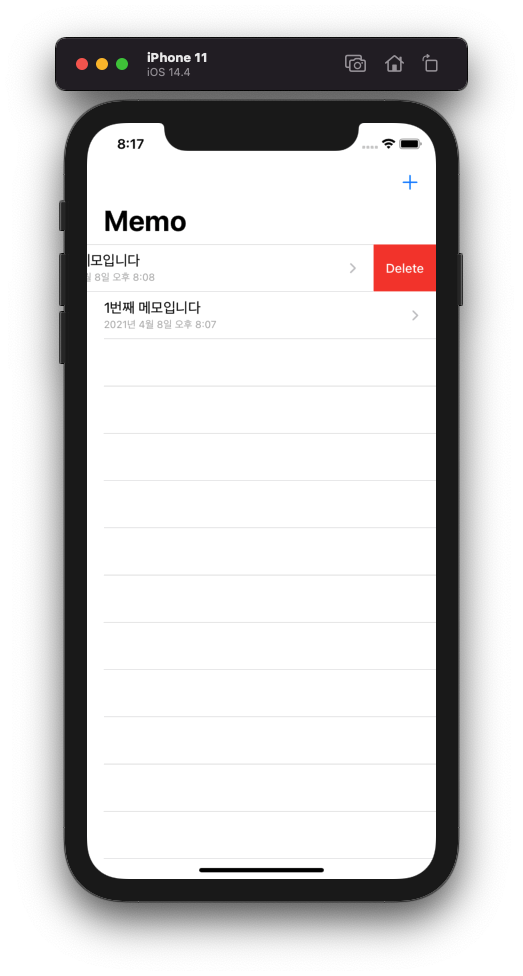

# MemoApp

## 프로젝트 계획 이유

> Swift에서 많이 사용되는 TableView 를 공부하며 사용해 보기 위해 메모앱을 만들어보게 되었다.

---

## 실행

> 클론 후 MemoApp_6.xcodeproj  
> simulator 선택 후 실행  
> 아직 개발자 등록은 하지 않아서 앱스토어에 등록 못함.

---

## 기능

- 새 메모 작성 (모달창 형식)
- 메모 보기화면 (편집, 공유, 삭제 툴바)
- 편집 후 모달창 내렸을때 경고 알람
- 공유하기 기능
- 메모삭제 기능
- 목록에서 스와이프 삭제 기능
- 메모 앱 내부 디비(Coredata)사용

메모앱 메인화면

새 메모쓰기화면
 메모보기화면
 메모편집화면
 메모편집시 삭제알림화면
 메모공유화면
 메모삭제알림화면
 메모 밀어서 삭제 화면

## 베운 점

- API 를 다루는 방법을 알게되었다.
- TableView를 다루는 연습을 하게 되었다.
- 커스텀 셀을 다르눈 방법을 알게되었다.
- 데이터 전달을 다루는 연습을 하게 되었다.
- 이미지 뷰에 그림자 효과 주는 법을 알게되었다.

## 프로젝트 정리 블로그 https://dangsalcoding.tistory.com/36
