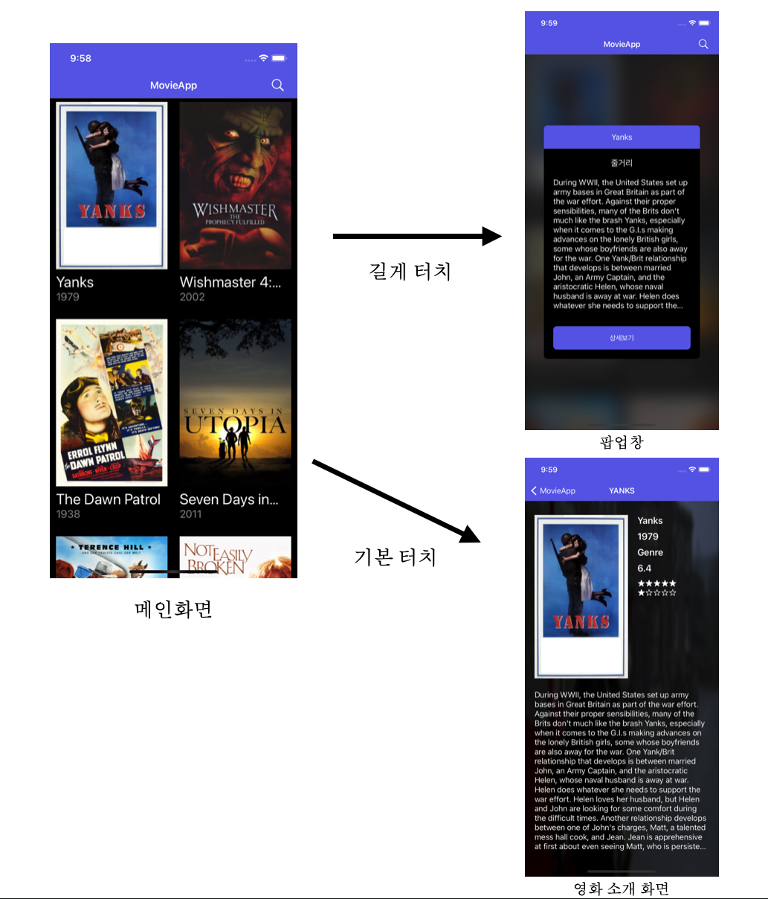

# Movie_App_without_Storyboard

## 프로젝트 계획 이유

> 스토리보드없이 MovieApp 다시 구현

---

## 실행

> 클론 후 NewsApp_without_Storyboard.xcodeproj  
> simulator 선택 후 실행  

---

## 기능

- 영화 api 를 받아와서 CollectionView 로 목록으로 구현함
- 영화를 길게 누를시 팝업창(줄거리) 표시
- 영화를 터치시 영화 정보를 소개해 주는 뷰로 이동
- 영화 제목으로 검색 가능

## 스크린샷

 

 

## 배운 점

- 스토리보드 없이 API 를 다루는 연습을 하게되었다.
- 스토리보드 없이 CollectionView를 다루는 연습을 하게 되었다.
- 스토리보드 없이 커스텀 셀을 다르눈 방법을 알게되었다.
- 스토리보드 없이 데이터 전달(프로토콜)을 다루는 연습을 하게 되었다.
- 애니메이션 효과에 대해 공부했다.
- 검색기능에 대해 공부했다.
- 아래로 내려서 새로고침에 대해 공부했다.

## 프로젝트 정리 블로그 ..
