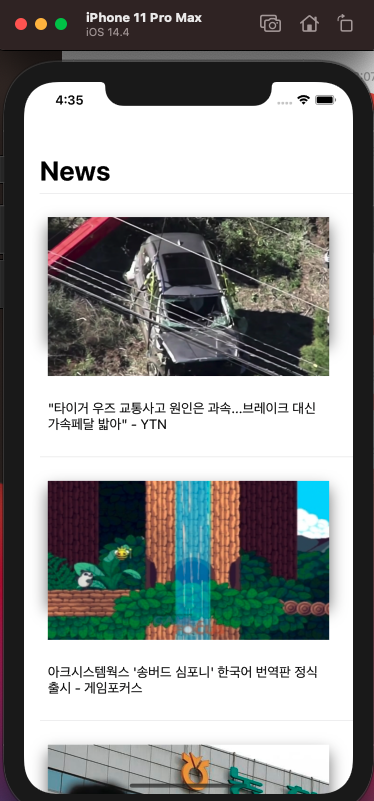
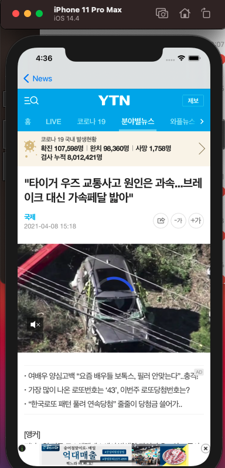

# NewsApp

## 프로젝트 계획 이유

> Swift 언어 공부 중 Open API 통신 연습을 하기 위해 계획하게 되었다.

---

## 실행

> 클론 후 NewsApp.xcodeproj  
> simulator 선택 후 실행

---

아직 개발자 등록은 하지 않아서 앱스토어에 등록 못함.

## 기능

- 뉴스 api 를 받아와서 TableView 로 목록으로 구현함
- 뉴스를 클릭 할 시 그 webView 로 그 뉴스보여줌

 

## 프로젝트 정리 블로그 https://dangsalcoding.tistory.com/36

### 그냥 OPEN API 연습 앱
