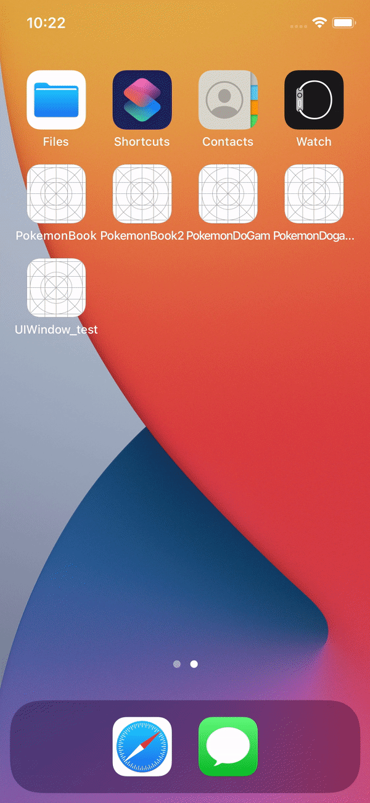

# PokemonDoGam

## 프로젝트 계획 이유

> 아버지께서 포켓몬GO 를 좋아하시는데 포켓몬 대결을 할때 포켓몬의 상성, 정보를 구글에 검색하고 하시는걸 보고
> 상성, 정보가 정리되어 있는 앱을 만들어드리면 편하실거 같아서 만들게 되었다.

---

## 실행

> 클론 후 PokemonDoGam.xcworkspace  
> simulator 선택 후 실행  
> 아직 개발자 등록은 하지 않아서 앱스토어에 등록 못함.

---

## 기능

- 검색 기능으로 원하는 포켓몬 검색 가능
- 원하는 포켓몬 컬렉션뷰로 구현
- 애니메이션 효과로 UI 개선
- 외부 라이브러리 SDWebImage 사용

## 추가할 기능

- 내가 갖고있는 포켓몬 등록
- 상대 포켓몬을 선택하면 내가 가진 포켓몬 중 상성상 유리한 포켓몬 자동 분류
- 한글화
   
   
   

## 배운 점

- 스토리보드 없이 프로그래머틱하게 코딩하는 방법을 알게되었다.
- CollectionView 사용 방법 연습하게 되었다.
- 외부 라이브러리를 사용하는 방법을 알게 되었다.
- 터치 이벤트
- 애니메이션 효과 공부를 하게 되었다.

## 프로젝트 정리 블로그 https://dangsalcoding.tistory.com/45
