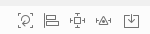

## AutoLayout : UI 배치규칙을 지정하는 기술

### 규칙을 지정해두면 Layout 시스템이 자동으로 위치나 크기를 조정해 주는 것

인터페이스 빌더에서 제약을 추가하는 방법은

1. 캔버스 메뉴를 사용하는 방법
   - 뷰의 여러개의 제약을 한번에 추가할 때 편리
   - 뷰의 현재 프레임을 무시하고 제약을 추가할 수 있다.
   - 
   - 제약을 이미 해둔 상태에서 새로 업데이트 하고 싶으면 4번째 메뉴의 Update Constraint Constants
   - Add new constrains 에서 값은 가장 인접한 뷰와의 거리값
2. 드래그 앤 드롭 방법
   - 두 뷰 사이의 제약을 추가할때 편리
   - 뷰의 현재 프레임 기준으로 제약이 추가되기 때문에 프레임을 원하는 값으로 설정 해 놔야해
   - leading(왼), trailing(오), top(위), bottom(아래) 제약

#### i bar 는 공간의 크기 , 너비 높이에 관련된 제약 표시

#### Priority 1000 은 필수 제약(실선)

    - 코드에서 우선순위를 바꿀때는 필수제약을 하면 안되고 더 낮은걸로 해야한다.
