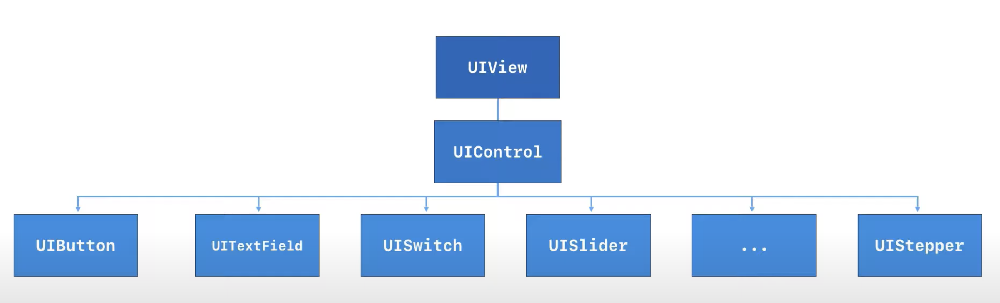

## Switch

## Slider

## Page Control

## Date Picker

## Semented Control

## Stepper

## Target-Action 방식을 통해 코드와 컨트롤을 연결하고 처리 할 수 있다.

    - Action : 이벤트 발생 시 호출되는 메소드
    - Target : 이 메소드가 구현되어 있는 객체
