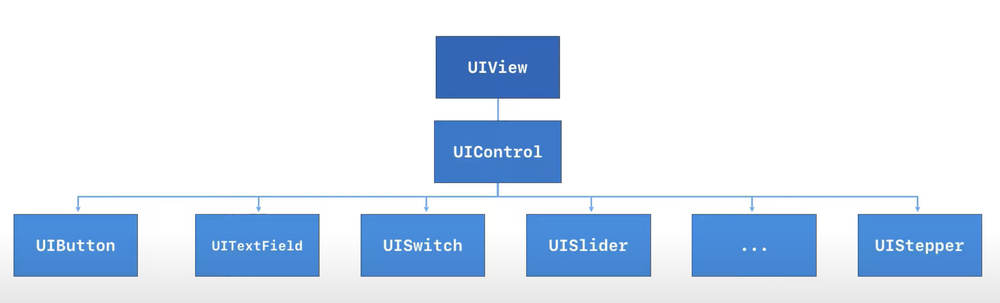

## Switch

## Slider

## Page Control

## Date Picker

## Semented Control

## Stepper



## Target-Action 방식을 통해 코드와 컨트롤을 연결하고 처리 할 수 있다.

    - Action : 이벤트 발생 시 호출되는 메소드
    - Target : 이 메소드가 구현되어 있는 객체

## Button : tab 을 처리하는 기본적인 컨트롤

    - 5가지 타입
    	1. System : 기본적인 타입. 타이틀과 이미지를 직접 설정할수 있다. 색상 변경 가능.
    	2. Detail Disclosure : 부가적인 정보를 모달이나 팝오버 형식으로 표시할때 사용. 어떤 위치에서도 자유롭게 사용가능 하지만 대부분 table cell 내부에서 사용함
    	3. Info Light : 앱과 관련된 상세 정보 구성정보를 확인할때 (어두운 배경에서 사용)
    	4. Info Dark : 앱과 관련된 상세 정보 구성정보를 확인할때 (밝은 배경에서 사용)
    	5. Add Contact : 주소 데이터를 추가할때 사용한다. (주소록에서 특정항목을 선택하거나 , 새로운 주소 데이터를 입력하는 화면표시 많이 쓰임)
    	+ costom buttom : 직접 타입 섞어서 만드는거

    - 4가지 상태 (터치 이벤트가 발생하거나 속성이 변경되었을경우 시각적으로 업데이트 된다.)  - state config
    	1. Default:
    	2. Highlighted:
    	3. Selected:
    	4. Disabled:
    	- 주의사항 : 여기에서 선택한 상태가 버튼의 실제 상태 아님 (상태와 연결된 속성을 변경하는것. 실제는 Control 섹션의 State 변경)
    	- 2개 이상의 상태 가질 수 있다.

### Text, Image Button : 상태에 맞는 title 미리 설정 해 놀 수 있다.

## Image View :

    - Content Mode:
    	1. Scale To Fill : 이미지 무시하고 프레임에 꽉 채운다.
    	2. Aspect Fit :
    	3. Aspect Fill : 이미지 뷰의 프레임을 무시한다. (clip to Bound 하면 프레임 밖 컷 )
    	4.
    - 기본적으로 2개의 이미지를 사용할 수 있다. (이미지, 하이라이티드 -> 조건에 따라 이미지 토글하는거에 사용 good(이미지 자체를 바꾸는거 보다 하이라이티드이미지로 구성하는거 더 심플))
    - 이미지에 따라 크기 자동? ---> 이미지 뷰 사이즈 적절하게 조절하고 content mode  설정 방식이 더 좋음
    - 애니메이션 가능 : 여러개 이미지 애니메이션 만들수 있다. (스토리 보드 안되고 코드를 통해서만 가능) placeholder 있어야 좋아.

```swift
	// 4개의 이미지를 배열에 넣는다.
	let images = (0...3)compactMap { UIImage(named: "phone-ring\($0)")}
	imageView.animationImages = images
	// startAnimation 메소드 만들고 imageView.StartAnimating() 실행
	// stopAnimation 메소드 만들고 if imageView.isAnimating{ imageView.StopAnimating() }

```
