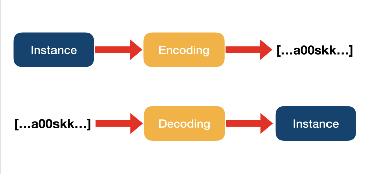

## Codable

- Encoding 은 정보의 형태나 형식을 표준화, 보안, 처리속도 향상, 저장 공간 절약 등을 위해서 다른 형태나 형식으로 변환하는 처리 혹은 그 처리 방식 :
- Decoding 은 인코딩의 반대 작업을 수행하는 것

- Codable : 스위프트의 인스턴스를 다른 데이터 형태로 변환할 수 있는 기능을 Encodable 프로토콜로 표현하고, 그 반대의 역할을 할 수 있는 기능을 Decodable 로 표현한다. 그 둘을 합한 타입을 Codable로 정의한다.

```swift
typealias Codable = Decodable & Encodable
```



- Decodable : 스위프트 타입의 인스턴스로 디코딩 할 수 있는 프로토콜
- Encodable : 스위프트 타입의 인스턴스를 인코딩 할 수 있는 프로토콜

```swift
struct Coordinate: Codable {
	var latitude: Double
	var longitude: Double
}

struct Landmark: Codable {
    var name: String
    var foundingYear: Int
    var vantagePoints: [Coordinate]
    var metadata: [String: String]
    var website: URL?
}
```

## CodingKey

JSON 형태의 데이터로 상호 변환하고자 할 때는 기본적으로 인코딩/디코딩할 JSON 타입의 키와 애플리케이션의 사용자정의 프로퍼티가 일치해야한다. 만약 JSON의 키 이름을 구조체 프로퍼티의 이름과 다르게 표현하려면 타입 내부에 String 타입의 원시값을 갖는 CodingKeys 라는 이름의 열거형을 선언하고 CodingKey 프로토콜을 준수하도록 하면 된다. CodingKeys 열거형 케이스의 이름은 해당 프로퍼티의 이름과 일치해야한다. 그리고 프로퍼티의 열거형 케이스의 값으로 매칭할 JSON 타입의 키를 할당하면 된다. 만약 JSON 타입의 키와 프로퍼티 이름이 일치한다면 값을 할당하지 않아도 무방하다.

```swift
struct Landmark: Codable {
    var name: String
    var foundingYear: Int
    var location: Coordinate
    var vantagePoints: [Coordinate]

    enum CodingKeys: String, CodingKey {
        case name = "title"
        case foundingYear = "founding_date"

        case location
        case vantagePoints
    }
}
```

## JSONEncoder / JSONDecoder

스위프트 4 버전 이전에는 JSONSerialization 을 사용해 JSON 타입의 데이터를 생성했다. <br>
스위프트 4 버전 이후에는 JSONEncoder / JSONDecoder 프로토콜을 지원하기 때문에 JSONEncoder / JSONDecoder 와 Codable 프로토콜을 이용해 손쉽게 JSON 형식으로 인코딩 및 디코딩 할 수 있다. <br>
JSONEncoder / JSONDecoder 을 활용해서 스위프트 타입의 인스턴스를 JSON 데이터로 인코딩, JSON 데이터에서 스위프트 타입의 인스턴스로 디코딩 할 수 있다.

## JSONEncoder

Codable 프로토콜을 준수하는 GroceryProduct 구조체의 인스턴스를 JSON 데이터로 인코딩하는 방법이다.

```swift
struct GroceryProduct: Codable {
    var name: String
    var points: Int
    var description: String?
}

let pear = GroceryProduct(name: "Pear", points: 250, description: "A ripe pear.")

let encoder = JSONEncoder()
encoder.outputFormatting = .prettyPrinted

do {
	let data = try encoder.encode(pear)
	print(String(data: data, encoding: .utf8)!)
} catch {
	print(error)
}

// ----- 출력
 {
   "name" : "Pear",
   "points" : 250,
   "description" : "A ripe pear."
 }

// Tip : encoder.outputFormatting = .prettyPrinted 설정하면 들여쓰기를 통해 가독성이 좋게 출력해줍니다.
```

## JSONDecoder

JSON 데이터를 Codable 프로토콜을 준수하는 GroceryProduct 구조체의 인스턴스로 디코딩하는 방법입니다.

```swift
struct GroceryProduct: Codable {
    var name: String
    var points: Int
    var description: String?
}

/// 스위프트 4 버전부터 """를 통해 여러 줄 문자열을 사용할 수 있습니다.
let json = """
{
    "name": "Durian",
    "points": 600,
    "description": "A fruit with a distinctive scent."
}
""".data(using: .utf8)!

let decoder = JSONDecoder()

do {
	let product = try decoder.decode(GroceryProduct.self, from: json)
	print(product.name)
} catch {
	print(error)
}
// ----- 출력
"Durian"
```
