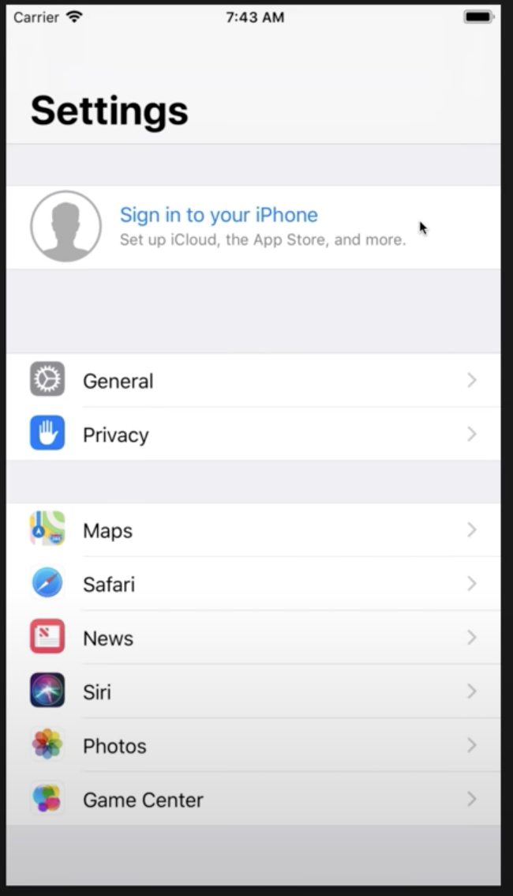
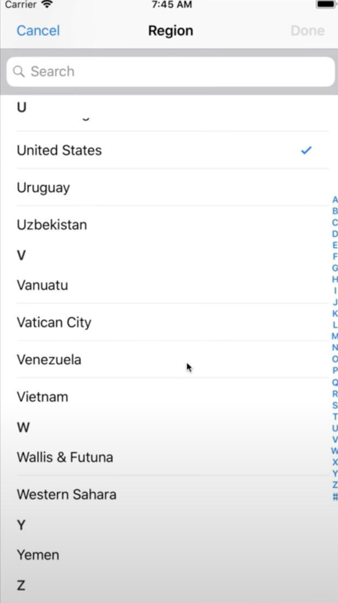
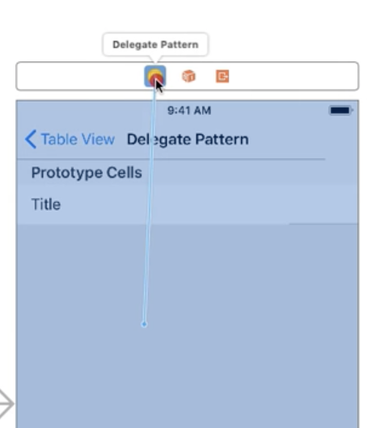

## Table View

: 세로방향으로 스크롤 되는 목록에 사용

개별항목은 Cell 이라고 부른다.

- 셀의 너비는 테이블뷰의 너비와 동일하다.
- 테이블 뷰에서 2개 이상의 셀을 수평으로 배치하는 것은 불가능 하다.
- 가로방향으로 스크롤 하는 것도 불가능

 이런 UI는 컬렉션 뷰로 구성해야함 <br>

<br><br>

3개의 그룹으로 구분 되어있음 -> 하나의 개별 그룹을 Section이라고 부른다.

- 하나의 섹션에는 하나 이상의 셀이 포함되거나 포함되지 않을 수 도 있다.
- 테이블 뷰는 섹션과 셀을 2차원 배열 형태로 관리한다. -> 셀위치를 고려할때는 섹션 위치와 셀 위치(IndexPath)를 모두 고려해야한다.
- cell index 는 Row Index 라고 불린다. ( 위사진에서 Siri 항목의 로우 인덱스는 Section Index:2, Row Index:3)
- 테이블 뷰는 2개의 스타일을 갖는다.

  1.  그룹 스타일 (섹션이 시각적으로 구분되어있는 스타일 (위사진))

  - 섹션 사이에 텍스트 출력
  - 커스텀 뷰 표시 가능

  2.  플레잉 스타일 <br>

       U V W Y 부분이 Header

  - 섹션에는 헤더와 풋터를 표시할 수 있다. 지금처럼 텍스트만 표시할수도 있고 커스텀뷰를 표시할수도 있다.
  - Floating 형식(?)

- 셀과 셀 사이 Separator (좌우여백, 스타일 지정 가능)

-----------------------------------------------------------------------------------<br>

### TableView Cell

- style
  1.  Basic : 하나의 텍스트를 출력할 때 사용한다.
  2.  Right Detail : 텍스트를 셀 양쪽에 하나씩 출력할 때 사용한다.
  3.  Left Detail : 텍스트 정열방식이 반대로 설정된다.
  4.  Subtitle : 텍스트가 수직으로 배치된다.
- Selection : 셀을 선택했을 때 시각적으로 강조하는 설정.

  1.  Default : 회색 배경
  2.  Blue : 파란색 배경
  3.  Gray : ios7 부터 Default 와 동일
  4.  None : 셀을 선택했을때 강조효과가 표시되지 않는다.

- Identifier : 셀을 식별할 수 있는 문자열 입력 ( ReUse Identifier ) (⭐️cell)

- Data Source : 데이터를 공급하는 델리게이트
  구현해야하는 메소드는 UITableViewDataSource 에 선언되어있다.<br>

   에서 dataSoruce 연결

```swift

import UIKit

class DelegatePetternViewController: UIViewController {

	let list = ["iPhone", "iPad", "Apple Watch" , "iMac Pro" , "iMac" , "Macbook Pro" ]

	override func viewDidLoad() {
		super.viewDidLoad()

	}
}

extension DelegatePetternViewController: UITableViewDataSource {

	func tableView(_ tableView: UITableView, numberOfRowsInSectionsection: Int) -> Int {
		// 섹션에 표시한 셀 수를 리턴해야한다.
		print("#1", #function) // 1번 메소드 출력이라는 로그
		return list.count
	}

	func tableView(_ tableView: UITableView, cellForRowAtIndexPath: IndexPath) -> UITableViewCell {
		// 셀을 생성하고 셀에 들어갈 데이터를 설정하고 리턴해야한다.
		print("#2", #function) // 2번 메소드 출력이라는 로그

		 let cell = tableView.dequeueResusableCell(withIdentifier: "cell", for: indexPath)
		 //(⭐️cell)

		cell.textLabel?.text = list[indexPath.row]

		return cell
	}
}
```

## 테이블 뷰를 구현하는 순서

1. 테이블 뷰를 화면에 추가하고 원하는 크기(제약)로 배치한다.
2. 테이블 뷰 셀(프로토타입셀) 을 추가하고 원하는 방식으로 구성한다.
3. 프로토타입셀에 Reuse Identifier 을 설정한다.
4. 테이블 뷰에 데이터 소스를 지정한다.(필요에 따라서 delegete 도 함께 지정한다.)
5. 데이터소스로 지정된 클래스에서 UITableVieWDataSource 프로토콜에서 선언되어 있는 필수메소드(2개) 를 구현한다.

// 재사용 메소드 설명 다시 정리..!

내용은 계속 추가 될 예정입니다.
