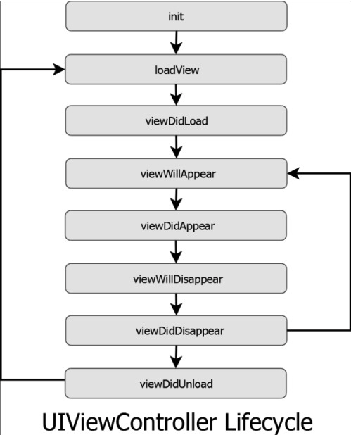

## UIViewController LifeCycle

### LifeCycle 흐름도

### init(coder:)

storyboard 를 통해 ViewController 를 만들 경우 ViewController의 객체가 생성될 때 초기화 작업을 하는 메소드가 init(coder:) 메소드이다.
 
이 메소드에서 초기화 작업을 할 때 View Controller들은 그들의 lifetime동안 필요한 자원들을 할당
 
아직 이 시점에서는 View Controller의 View가 생성된 것이 아니기 때문에 View의 요소들에 대한 접근을 시도한다면 에러를 발생.

### loadView()

이 메소드는 화면에 띄어질 view를 만드는 메소드. outlet 과 action 이 메소드에서 생성되고 연결된다.

### viewDidLoad()

이 메소드가 호출되는 시점에는 이미 outlet 들이 메모리에 위치하고 있다. 그러므로 사용자에게 화면이 보여지기 전 데이터를 뿌려주는 행위에 대한 코드를 작성. 보통 화면이 로드되기 전 백그라운드에서 처리해 주어야 하는 작업들이 위치하기 좋은데 그 예로는 네트워크 호출 등이 있다.
 
이 메소드는 viewController 라이프 사이클 동안 한번만 호출된다. 그래서 한번만 일어날 행위들에 대해 이 메소드안에 정의를 해주어야 한다.
주기적으로 데이터가 변경되거나 하는 행위는 다른 메소드에서 정의해 줘야 한다.

### viewWillAppear(\_:)

이 메소드는 viewController 의 화면이 올라오고 난 후에 호출되는 메소드이다. 이 메소드에서는 UI내의 애니메이션을 실행시키거나, 비디오나 소리를 재생하는 행위, 그리고 뿌려지는 데이터의 업데이트를 수행할 수 있다.
 
처음 앱이 수행되고 첫 화면이 띄어질 때도 호출되는 것은 viewDidLoad와 동일하지만 화면전환을 통해 다시 현재의 화면으로 돌아올때는 viewWillApperar로 호출된다.

### viewDidApper(\_:)

viewController 의 뷰가 데이터와 함께 완전히 화면에 나타나고 호출되는 메소드이다.

### didReceiveMemoryWarning()

IOS 기기들은 제한된 메모리 크기와 전원을 갖고 있다. 메모리가 채워지기 시작하면 일반적인 컴퓨터의 운영체제와는 다르게 메모리가 부족하면 메모리의 데이터를 하드디스크로 옮기는 작업을 하지않는다. 이러한 이유로 앱의 메모리 사용량을 줄여야 한다. 만약 너무 많은 메모리를 사용하고 있다면 IOS는 이를 알린다.
 
viewController 가 자원관리를 하고 있는 동안 이러한 알람들은 이 메소드를 통해 그들에게 전닿된다. 이러한 방식으로 몇몇의 메로리를 해지하는 등의 행동을 취할 수 있다. 이러한 경고 알림을 무시하고 앱의 메모리 사용량이 일정 한계치를 넘어가게 된다면 IOS는 앱을 강제로 끝낸다.
이러한 현상은 사용자로 하여금 앱의 충돌로 보일 수 있으므로 반드시 피해야한다.

### viewWillDisappear(\_:)

다음 viewController 로 화면이 전환되기 전, original viewController 가 화면에서 사라질 때 이 메소드가 호출된다. 이 시점에서 해야할 일반적인 작업들은 거의 없기 때문에 굳이 override 할 필요는 없다.

### viewDidDisappear(\_:)

viewController 들이 화면에서 사라지고 나서 이 메소드가 호출된다. 화면에서 viewController 가 사라진 이후에는 멈추어야할 작업들은 override하여 작성할 수 있다.
예를 들면 notification 을 듣는 행위를 멈추기, 다른 객체의 속성을 observing 하는것을 멈추기, 디바이스의 센서를 점검하거나 네트워크를 호출하는 행위들은 화면이 사라지고 나서는 필요 없는 작업들이다.

### deinit()

다른 모든 객체와 마찬가지로 viewController가 메모리에서 사라지기 전 이 메소드가 호출된다. 대개 이 메소드를 할당 받은 자원 중 ARC 에 의해 해지가 불가능한 자원들을 해제하기 위해 override 할 수 있다. 또한 백그라운드에서 돌리기 위해 이전의 메소드에서 멈추지 못하였던 행위들을 이 메소드 내에서 멈출 수 있다.

 
viewController 가 화면에서 사라지는 것이 메모리에서 해지된다는 것을 의미하지 않는다.
즉 화면에서 사라진다고 메모리에서 해지되는 것은 아니다.
많은 Container viewcontroller 들이 그들의 viewController 들을 메로리에서 유지하고 있기 때문이다.
 
화면에서 사라진 viewController 들이 정상적으로 작동하고 여전히 notificationdmf 받을 수 있다는 것을 생각해야한다.
