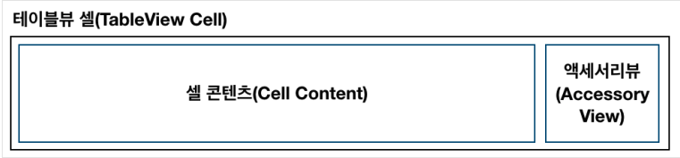
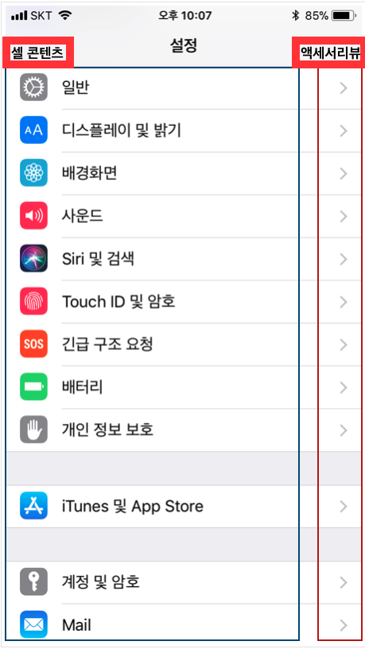
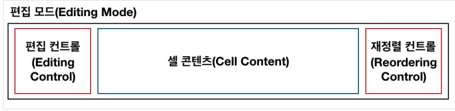
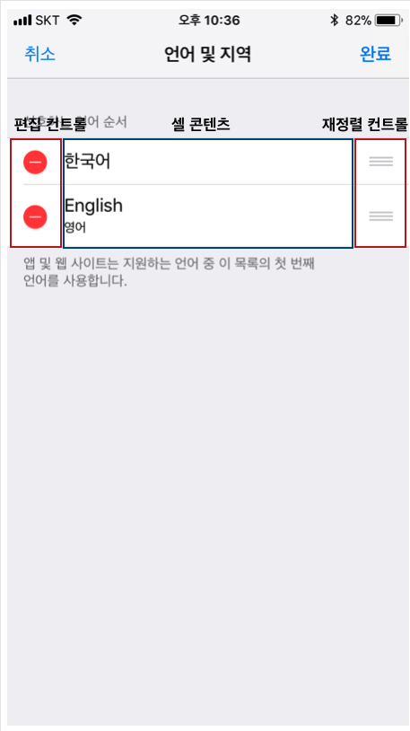
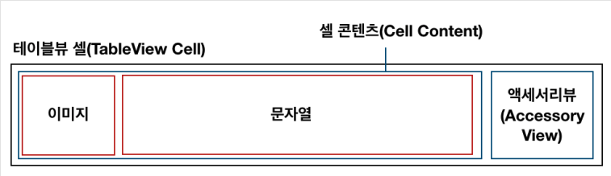
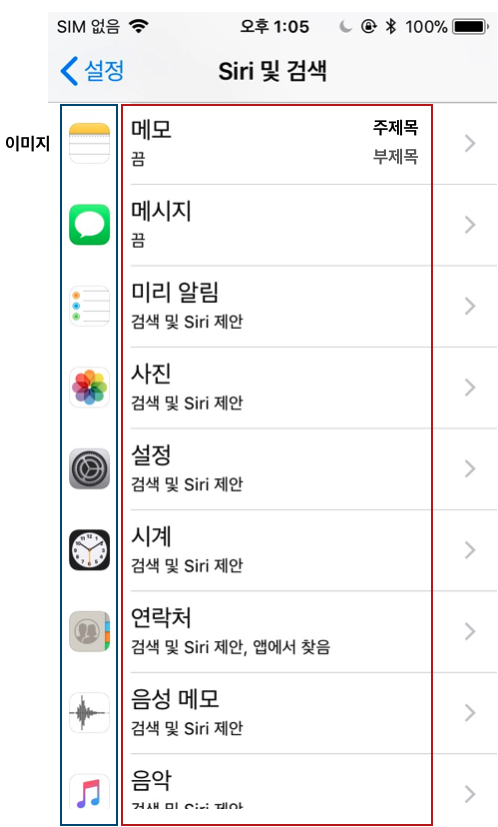

## Table View : IOS 애플리케이션에서 정보를 리스트 형태로 보여주기 위해 사용되는 뷰

: 테이블뷰는 리스트 형태를 지니고 있으며 스크롤이 가능해 많은 정보를 보여 줄 수 있다. <br>

### 테이블뷰 기본 형태

1. 테이블뷰는 하나의 열(column)과 여러 줄 행(row)을 지니며, 수직으로만 스크롤 가능하다.
2. 각 행은 하나의 셀(cell)에 대응한다.
3. 섹션(section)을 이용해 행을 시각적으로 나눌 수 있다.
4. 헤더(header) 와 푸터(footer)에 이미지나 텍스트를 추가해 추가 정보를 보여 줄 수 있다.

### 테이블뷰 스타일

: 테이블뷰는 크게 두 가지 스타일(일반,그룹)으로 나눈다. <br>

1. 일반 테이블뷰(Plain TableView)
   - 더이상 나뉘지 않는 연속적인 행의 리스트 형태이다.
   - 하나 이상의 섹션을 가질 수 있으며, 각 섹션은 여러 개의 행을 지닐 수 있다.
   - 각 섹션은 헤더 혹은 푸터를 옵션으로 지닐 수 있다.
   - 색인을 이용한 빠른 탐색을 하거나 옵션을 선택할 때 용이하다.
2. 그룹 테이블뷰(Grouped TableView)
   - 섹션을 기준으로 그룹화되어있는 리스트 형태이다.
   - 하나 이상의 섹션을 가질 수 있으며, 각 섹션은 여러 개의 행을 지닐 수 있다.
   - 정보를 특정 기준에 따라 개념적으로 구분 할 때 적합하다.
   - 사용자가 정보를 빠르게 이해하는데 도움이 된다.

### 테이블뷰 생성

: 테이블뷰를 생성하고 관리하는 좋은 방법은 스토리보드에서 커스텀 UITableViewController 클래스의 객체를 이요하는것이다.(필요에 따라 소스코드 테이블 뷰를 생성하는 것도 가능) <br>
스토리보드에서 테이블뷰의 특성을 지정할 때, 동적 프로토타입 혹은 정적 셀 중 하나를 선택 할 수 있다. <br>
새로운 테이블뷰를 생성할 때 기본 설정 값은 동적 프로토타입이다.

1. 동적 프로토타입(Dynamic Prototypes)
   - 셀 하나를 디자인해 이를 다른 셀의 템플릿으로 사용하는 방식
   - 같은 레이아웃의 셀을 여러 개 이용해 정보를 표시 할 경우
   - 데이터소스(UITableViewDataSource)인스턴스에 의해 콘텐트를 관리하며, 셀의 개수가 상황에 따라 변하는 경우에 사용
2. 정적 셀 (Static Cells)
   - 고유의 레이아웃과 고정 된 수의 행을 가지는 테이블뷰에 사용
   - 테이블뷰를 디자인하는 시점에 테이블의 형태와 셀의 개수가 정해져 있는경우 사용
   - 셀의 개수가 변하지 않음

### 테이블뷰 구성요소

: 테이블뷰를 구성하기 위해 꼭 알아야 하는 개념에는 셀, 델리게이트 , 데이터소스 가 있다.

### 테이블뷰 셀

: 테이블뷰를 이루는 개별적인 행으로 UITableViewCell 클래스를 상속받는다. UITableViewCell 클래스에 정의된 표준스타일을 활용해 문자열 또는 이미지를 제공하는 셀을 생성할 수있으며, 커스텀 서브뷰를 올려 다양한 시각적 모습을 나타 낼 수 있다.

### 테이블뷰 셀의 구조

: 기본적으로 테이블뷰 셀은 아래 이미지와 같이 크게 콘텐츠 영역과 액세서리뷰 영역으로 구조가 나뉜다.<br>

<br><br>

 <br>

: 테이블 뷰를 편집모드로 전환하면 아래와 같은 구조로 변한다.<br>

- 편집 컨트롤은 삭제 컨트롤(빨간 원 안의 마이너스 기호) 또는 추가 컨트롤(녹색 원 안의 플러스 기호) 중 하나가 될 수 있다.
- 재정렬이 가능한 경우, 재정렬 컨트롤이 액세서리 뷰에 나타난다. 재정렬 컨트롤을 눌러 셀을 드래그 하면 위아래로 순서를 변결 할 수 있다.
  <br>

 <br>
<br>

 <br>

: 테이블뷰 셀의 기본 기능

- UITableViewCell 클래스를 상속받는 기본 테이블뷰 셀은 표준 스타일을 이용 할 수 있다. 표준 스타일 콘텐츠 영역은 한개 이상의 문자열 그리고 이미지를 지닐 수 있으며, 이미지가 오른쪽으로 확장됨에 따라 문자열이 오른쪽으로 밀려난다.
- UITableViewCell 클래스는 셀 콘텐츠에 세 가지 프로퍼티가 정의되어 있습니다.
  - textLabel: UILabel: 주제목 레이블
  - detailTextLabel: UILabel: 추가 세부 사항 표시를 위한 부제목 레이블
  - imageView: UIImageView: 이미지 표시를 위한 이미지뷰

 <br>

 <br>
<br>

### 커스텀 테이블 뷰 셀

- UITableViewCell 클래스에서 제공하는 표준 스타일 셀을 이용해 이미지와 문자열을 표현하고 글꼴 및 색상 등을 수정할 수 있지만, 기본 형태를 벗어나 다양한 애플리케이션의 요구를 충족시키기 위해 셀을 커스텀 할 수 있습니다. 셀을 커스텀 하면 이미지를 텍스트 오른쪽에 위치시키는 등 원하는 시각적 형태를 만들 수 있습니다.
- 셀을 커스텀 하는 방법에는 크게 두 가지 방법이 있는데, 스토리보드를 이용하거나 코드로 구현할 수 있습니다.
  - 셀의 컨텐츠뷰에 서브류 추가하기
  - UITableViewCell의 커스텀 서브클래스 만들기<br>

\*\* [참고] UITableViewCell의 서브클래스를 이용해 커스텀 이미지뷰를 생성하는 경우, 이미지뷰의 변수명을 imageView로 명명하면 기본 이미지뷰 프로퍼티와 변수명이 같아 원하는 대로 동작하지 않을 수 있으니 반드시 커스텀 이미지뷰의 변수명은 다르게 지어주세요(예. detailImageView, thumbnailImageView, profileImageView). textLabel, detailLabel, accessoryView 등의 기본 프로퍼티 이름 모두 마찬가지입니다.

<br>
## DataSource 와 Delegate
: 테이블 뷰는 테이블뷰에 데이터를 표시하기 위해 몇몇 정보를 물어본다.

1. DataSource

- 테이블뷰 데이터 소스 객체는 UITableViewDataSource 프로토콜을 채택합니다.
- 데이터 소스는 테이블 뷰를 생성하고 수정하는데 필요한 정보를 테이블뷰 객체에 제공합니다.
- 데이터 소스는 데이터 모델의 델리게이트로, 테이블뷰의 시각적 모양에 대한 최소한의 정보를 제공합니다.
- UITableView 객체에 섹션의 수와 행의 수를 알려주며, 행의 삽입, 삭제 및 재정렬하는 기능을 선택적으로 구현할 수 있습니다.
- UITableViewDataSource 프로토콜의 주요 메서드는 아래와 같습니다. 이 중 @required로 선언된 두 가지 메서드는 UITableViewDataSource 프로토콜을 채택한 타입에 필수로 구현해야 합니다.

```swift
 @required
 // 특정 위치에 표시할 셀을 요청하는 메서드
 func tableView(UITableView, cellForRowAt: IndexPath)

 // 각 섹션에 표시할 행의 개수를 묻는 메서드
 func tableView(UITableView, numberOfRowsInSection: Int)

 @optional
 // 테이블뷰의 총 섹션 개수를 묻는 메서드
 func numberOfSections(in: UITableView)

 // 특정 섹션의 헤더 혹은 푸터 타이틀을 묻는 메서드
 func tableView(UITableView, titleForHeaderInSection: Int)
 func tableView(UITableView, titleForFooterInSection: Int)

 // 특정 위치의 행을 삭제 또는 추가 요청하는 메서드
 func tableView(UITableView, commit: UITableViewCellEditingStyle, forRowAt: IndexPath)

 // 특정 위치의 행이 편집 가능한지 묻는 메서드
 func tableView(UITableView, canEditRowAt: IndexPath)

 // 특정 위치의 행을 재정렬 할 수 있는지 묻는 메서드
 func tableView(UITableView, canMoveRowAt: IndexPath)

 // 특정 위치의 행을 다른 위치로 옮기는 메서드
 func tableView(UITableView, moveRowAt: IndexPath, to: IndexPath)
```

2. Delegate

- 테이블뷰 델리게이트 객체는 UITableViewDelegate 프로토콜을 채택합니다.
- 델리게이트는 테이블뷰의 시각적인 부분 수정, 행의 선택 관리, 액세서리뷰 지원 그리고 테이블뷰의 개별 행 편집을 도와줍니다.
- 델리게이트 메서드를 활용하면 테이블뷰의 세세한 부분을 조정할 수있습니다.
- UITableViewDelegate 프로토콜의 주요 메서드는 아래와 같습니다. 이 중 필수로 구현해야 하는 메서드는 없습니다.

```swift
// 특정 위치 행의 높이를 묻는 메서드
 func tableView(UITableView, heightForRowAt: IndexPath)
 // 특정 위치 행의 들여쓰기 수준을 묻는 메서드
 func tableView(UITableView, indentationLevelForRowAt: IndexPath)

 // 지정된 행이 선택되었음을 알리는 메서드
 func tableView(UITableView, didSelectRowAt: IndexPath)

 // 지정된 행의 선택이 해제되었음을 알리는 메서드
 func tableView(UITableView, didDeselectRowAt: IndexPath)

 // 특정 섹션의 헤더뷰 또는 푸터뷰를 요청하는 메서드
 func tableView(UITableView, viewForHeaderInSection: Int)
 func tableView(UITableView, viewForFooterInSection: Int)

 // 특정 섹션의 헤더뷰 또는 푸터뷰의 높이를 물어보는 메서드
 func tableView(UITableView, heightForHeaderInSection: Int)
 func tableView(UITableView, heightForFooterInSection: Int)

 // 테이블뷰가 편집모드에 들어갔음을 알리는 메서드
 func tableView(UITableView, willBeginEditingRowAt: IndexPath)

 // 테이블뷰가 편집모드에서 빠져나왔음을 알리는 메서드
 func tableView(UITableView, didEndEditingRowAt: IndexPath?)
```

### 뷰의 재사용

: IOS 기기는 한정된 메모리를 가지고 애플리케이션을 구동한다. 만약 사용자에게 보여주고 싶은 데이터가 매우 많고, 데이터의 양만큼 많은 뷰가 필요하지만 화면에 표시할 수 있는 뷰의 개수는 한정되어있고, 표현해야하는 데이터가 많은 경우 반복된뷰를 생성하기보다는 뷰를 재사용할수있다.사용할 수 있는 메모리가 작아서 데이터의 양만큼 많은 뷰를 생성하는 것은 메모리를 많이 낭비 할 수밖에 없다. 뷰를 재사용함으로서 메모리를 절약하고 성능 또한 향상 할 수 있다.

### 재사용의 대표적인 예

: iOS 환경에서 뷰를 재사용하는 대표적인 예로 UITableViewCell, UICollectionViewCell 등이 있다.

- UITableViewCell : UITableView의 셀이다.
- UICollectionViewCell : UICollectionView의 셀이다.
